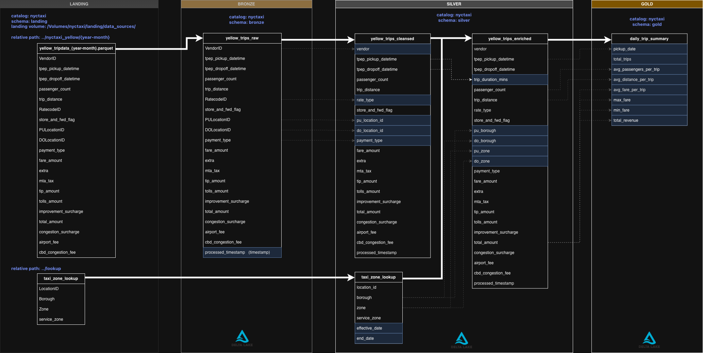

# NYC Taxi Data Platform on Databricks

## Overview

This project implements a **production-style data platform** for the NYC Taxi dataset using **Databricks, PySpark, Spark SQL, and Delta Lake**. The pipeline follows a **Bronze / Silver / Gold medallion architecture**, supports both **historical backfills** and **monthly incremental ingestion**, and incorporates **Slowly Changing Dimension (SCD) Type 2** modeling to preserve historical changes in reference data.

The project is structured to closely mirror real-world data engineering workflows, emphasizing **automation, idempotency, governance, and analytics readiness**.

---

## Architecture

The platform is organized into four logical layers:

### Landing
- Raw NYC Taxi parquet files staged in a **Unity Catalog Volume**
- Partitioned by `year-month` to support efficient backfills and incremental loads
- Lookup/reference datasets (e.g., taxi zones) staged alongside raw sources

### Bronze
- Raw ingestion of taxi trip data into Delta tables
- Minimal transformations to preserve source fidelity
- Adds ingestion metadata (e.g., `processed_timestamp`)
- Acts as the immutable system of record

### Silver
- Cleansed and conformed datasets
- Derived fields added (e.g., `trip_duration_mins`)
- Enrichment with pickup/dropoff borough and zone attributes
- **SCD Type 2** implemented for taxi zone lookup data using effective and end dates

### Gold
- Analytics-ready fact tables
- Pre-aggregated metrics optimized for BI and reporting
- Supports historical analysis and time-based comparisons

---

## Slowly Changing Dimensions (SCD Type 2)

The taxi zone lookup table is modeled as an **SCD Type 2 dimension** to track historical changes over time.

Key features:
- Versioned records with `effective_date` and `end_date`
- Current-record identification
- Idempotent updates using Delta Lake `MERGE` operations
- Enables accurate point-in-time analytics

---

## Data Pipelines & Job Design

Two primary workflows drive the platform:

### 1. Historical Backfill Pipeline
- Loads historical NYC Taxi data across all months
- Populates Bronze, Silver, and Gold layers
- Designed to be safely re-runnable
- Handles large-scale ingestion efficiently

### 2. Monthly Incremental Pipeline
- Processes newly available monthly data
- Applies incremental logic only
- Updates SCD Type 2 dimensions
- Keeps analytics tables current with minimal compute usage

Both pipelines are implemented as **Databricks Jobs** and are designed to be **idempotent and fault-tolerant**.

---

## Repository Structure

nyc-taxi-databricks/
├── ad_hoc/
│   ├── yellow_taxi_eda.py
│   └── yellow_taxi_eda2.py
│
├── one_off/
│   └── initial_load/notebooks/
│       ├── 01_bronze/
│       │   └── 01_yellow_trips_raw.py
│       ├── 02_silver/
│       │   ├── 01_taxi_zone_lookup.py
│       │   ├── 02_yellow_trips_cleansed.py
│       │   └── 03_yellow_trips_enriched.py
│       ├── 03_gold/
│       │   └── daily_trips_summary.py
│       ├── backfill_historical_yellow_trips.py
│       ├── creating_catalogs_schema_volume.py
│       └── load_taxi_zone_lookup.py
│
├── transformations/notebooks/
│   ├── 00_landing/
│   │   ├── ingest_lookup.py
│   │   └── ingest_yellow_trips.py
│   ├── 01_bronze/
│   │   └── 01_yellow_trips_raw.py
│   ├── 02_silver/
│   │   ├── 01_taxi_zone_lookup.py
│   │   ├── 02_yellow_trips_cleansed.py
│   │   └── 03_yellow_trips_enriched.py
│   └── 03_gold/
│       └── daily_trips_summary.py
│
├── utils/
│   ├── init.py
│   ├── functions.py
│   └── table_checks.py
│
├── README.md
└── project_architecture.png

### Directory Highlights

- **one_off/**  
  One-time setup and historical backfill workflows (catalog creation, schema setup, historical loads).

- **transformations/**  
  Production pipelines for recurring monthly ingestion and transformation.

- **utils/**  
  Shared utility functions for parameter handling, validation, and table checks.

- **ad_hoc/**  
  Exploratory analysis and experimentation notebooks.

---  

## Databricks Jobs  

### Yellow Taxi Initial Load

The **Yellow Taxi Initial Load** job performs a full historical backfill of NYC TLC Yellow Taxi trip data and populates the **Bronze, Silver, and Gold** layers of the platform.

The job is parameterized by `end_month` and `prev_months`, allowing flexible reprocessing across arbitrary date ranges. It orchestrates a sequence of dependent tasks to download raw data, ingest it into Delta Lake, apply cleansing and enrichment logic, implement **SCD Type 2** modeling for taxi zone reference data, and generate analytics-ready Gold aggregates.

This job is designed to be **idempotent**, safely re-runnable, and is intended for initial platform setup or historical reprocessing. It sources all notebooks directly from GitHub and runs as a performance-optimized Databricks Job.

### Yellow Taxi Monthly Load

The **Yellow Taxi Monthly Load** job incrementally processes newly released NYC TLC Yellow Taxi data on a scheduled basis, keeping the platform up to date with minimal compute usage.

The job ingests new raw trip and lookup data into the Landing layer, conditionally propagates changes downstream, applies **SCD Type 2** updates to taxi zone reference data, and incrementally updates the Bronze, Silver, and Gold layers. Conditional tasks ensure downstream processing only occurs when new data is detected, making the pipeline efficient and fault-tolerant.

This job is designed for **automated monthly execution**, supports idempotent re-runs, and sources all notebooks directly from GitHub. It serves as the ongoing ingestion mechanism following the initial historical backfill.

---

## Technologies Used

- **Databricks**
- **PySpark**
- **Spark SQL**
- **Delta Lake**
- **Unity Catalog (Volumes, Schemas)**
- **Databricks Jobs**
- **Medallion Architecture**
- **SCD Type 2 Dimensional Modeling**

---

## Key Design Principles

- **Scalability**: Handles large historical datasets and continuous growth
- **Reliability**: Idempotent pipelines and ACID guarantees via Delta Lake
- **Maintainability**: Clear separation of concerns across layers
- **Governance**: Unity Catalog–managed storage and schemas
- **Analytics Readiness**: Gold tables optimized for BI and downstream consumers

---

## Potential Extensions

- Data quality validation and anomaly detection
- BI dashboards (Tableau / Power BI)
- Cost and performance monitoring
- Demand forecasting or anomaly detection models built on Gold tables

---

## Summary

This project demonstrates how to build a **production-grade analytics platform** on Databricks using modern data engineering patterns. It combines automated ingestion, incremental processing, historical change tracking, and analytics-ready data modeling to support scalable and reliable insights from NYC Taxi data.
